# Multi-Agent Productivity Suite 🤖✨


> **Empower your workflow with intelligent, collaborative AI agents.**

## 📖 Overview

The **Multi-Agent Productivity Suite** is an advanced AI-driven system designed to automate complex personal productivity tasks. Built on **LangChain** and **LangGraph**, it orchestrates a team of specialized agents—capable of managing your calendar and drafting emails—while maintaining strict **Human-in-the-Loop (HITL)** control for sensitive actions.

Unlike simple chatbots, this system maintains state, understands context, and collaborates to achieve high-level goals like "Schedule a meeting with the design team and send them an invite."

## 🚀 Key Features

-   **🧠 Intelligent Orchestration**: A central **Supervisor Agent** analyzes user requests and dynamically routes tasks to the appropriate sub-agents (Email or Calendar).
-   **🛡️ Human-in-the-Loop (HITL)**: Secure by design. Sensitive actions (like sending emails) trigger an interrupt, requiring explicit user approval ("Approve", "Reject", or "Edit") before execution.
-   **📅 Smart Scheduling**: Natural language interaction with **Google Calendar** to query availability and schedule events.
-   **📧 Context-Aware Emailing**: Drafts smart, context-rich emails using **Gmail API**, with the ability to iteratively refine drafts based on user feedback.
-   **🔌 Extensible Design**: Modular architecture allows for easy addition of new agents and tools.

## 🏗️ Architecture

The system follows a hierarchical agentic pattern:

```mermaid
graph TD
    User([👤 User]) <-->|Natural Language| Supervisor[👮 Supervisor Agent]
    
    subgraph "Agent Team"
        Supervisor -->|Routes Task| EmailAgent[📧 Email Agent]
        Supervisor -->|Routes Task| CalAgent[📅 Calendar Agent]
    end
    
    subgraph "Tools & APIs"
        EmailAgent <-->|Read/Draft| Gmail[Gmail API]
        CalAgent <-->|Query/Schedule| GCal[Google Calendar API]
    end
    
    EmailAgent -.->|Request Approval| Hitl{🛡️ HITL Check}
    Hitl -.->|Approve/Reject| User
    User -.->|Feedback| Hitl
    Hitl -.->|Execute| Gmail
```



## 🛠️ Technology Stack

-   **Core Framework**: [LangChain](https://www.langchain.com/) & [LangGraph](https://langchain-ai.github.io/langgraph/)
-   **Language**: Python 3.9+
-   **LLM Engine**: OpenAI GPT-4o / Anthropic Claude 3.5 Sonnet (Configurable)
-   **Integrations**: Google Workspace APIs (Gmail, Calendar)
-   **Testing**: Pytest

## 🚀 Getting Started

### Prerequisites

-   Python 3.9 or higher
-   Google Cloud Console Project with Gmail and Calendar APIs enabled.
-   `credentials.json` from Google Cloud (OAuth 2.0 Client ID).

### Installation

1.  **Clone the repository:**
    ```bash
    git clone https://github.com/jelimutaalidev/multi-agent-productivity-suite.git
    cd multi-agent-productivity-suite
    ```

2.  **Create a virtual environment:**
    ```bash
    python -m venv venv
    source venv/bin/activate  # On Windows: venv\Scripts\activate
    ```

3.  **Install dependencies:**
    ```bash
    pip install -r requirements.txt
    ```

4.  **Configuration:**
    Create a `.env` file in the root directory:
    ```ini
    OPENAI_API_KEY=sk-your-api-key
    # Or for Anthropic
    ANTHROPIC_API_KEY=sk-ant-your-api-key
    ```
    Place your `credentials.json` in the root folder.

## 💡 Usage

Start the main application:

```bash
python main.py
```

### Example Commands

*   **Scheduling**: *"Schedule a sync meeting with the engineering team for next Tuesday at 10 AM."*
*   **Emailing**: *"Send an email to john@example.com updating him on the project status."*
*   **Complex Workflow**: *"Check my calendar for Friday afternoon. If I'm free, schedule a wrap-up call and send an invite to the team."*

## 🤝 Contributing

Contributions are welcome! Please feel free to submit a Pull Request.

1.  Fork the repository
2.  Create your feature branch (`git checkout -b feature/AmazingFeature`)
3.  Commit your changes (`git commit -m 'Add some AmazingFeature'`)
4.  Push to the branch (`git push origin feature/AmazingFeature`)
5.  Open a Pull Request

## 📄 License

This project is licensed under the MIT License - see the [LICENSE](LICENSE) file for details.
